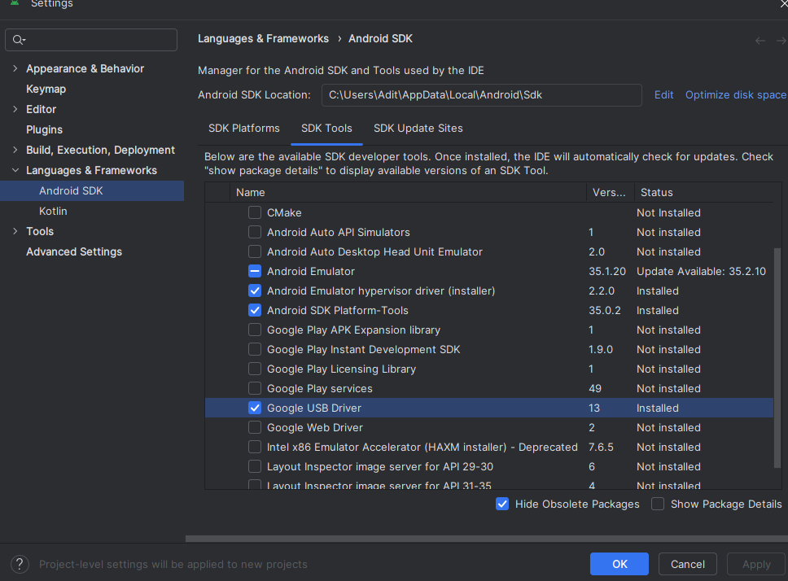
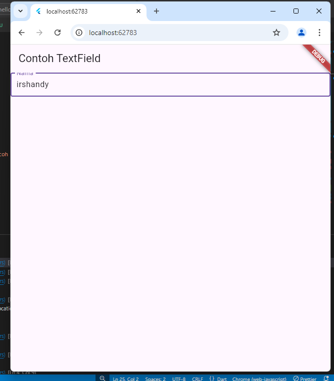

# Dokumentasi
Nama    : Irshandy Aditya Wicaksana
Kelas   : TI-3A / 16
NIM     : 2241720148
Link    : https://github.com/irshandyaditya/flutter-fundamental-part1

Praktikum 1:
Langkah 1:

Langkah 2:

Langkah 3:

Langkah 4:

Praktikum 2:
a. Mengaktifkan proses debug USB:
melihat pesan You are now a developer:

ketuk tombol USB debugging:

b. Menginstal Driver USB Google (khusus Windows):

c. Menjalankan aplikasi di perangkat Android menggunakan kabel:

hasil:

Praktikum 3:
Langkah 1:

Langkah 2:

Langkah 3:

Langkah 4:

Langkah 5:

Langkah 9:

Langkah 10:

Langkah 11:

Langkah 12:

Praktikum 4:
Langkah 1:

Langkah 2:

Praktikum 5:
Langkah 1:

Langkah 2:

Alert:

Input and selection widget:

Date Time and Time Picker:

