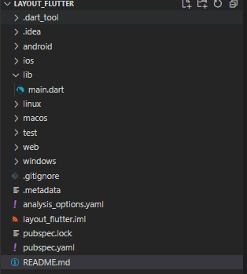
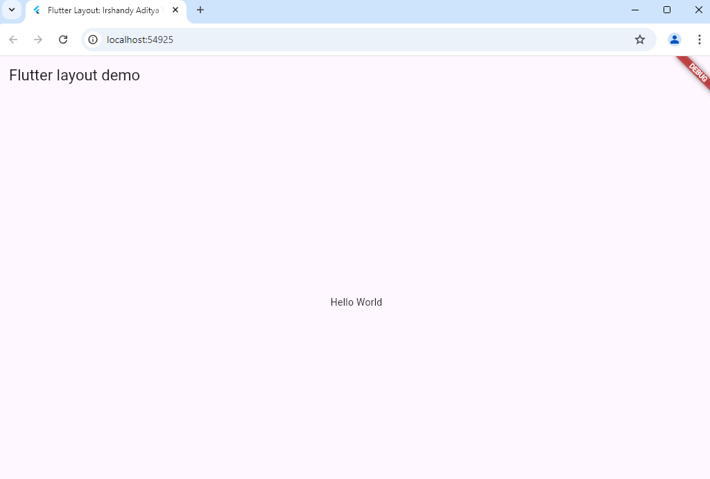
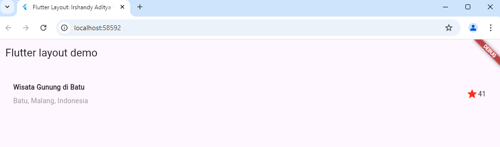
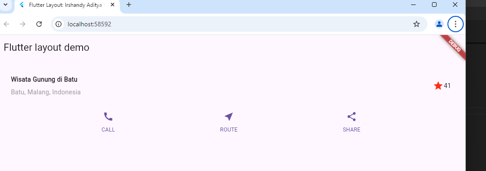
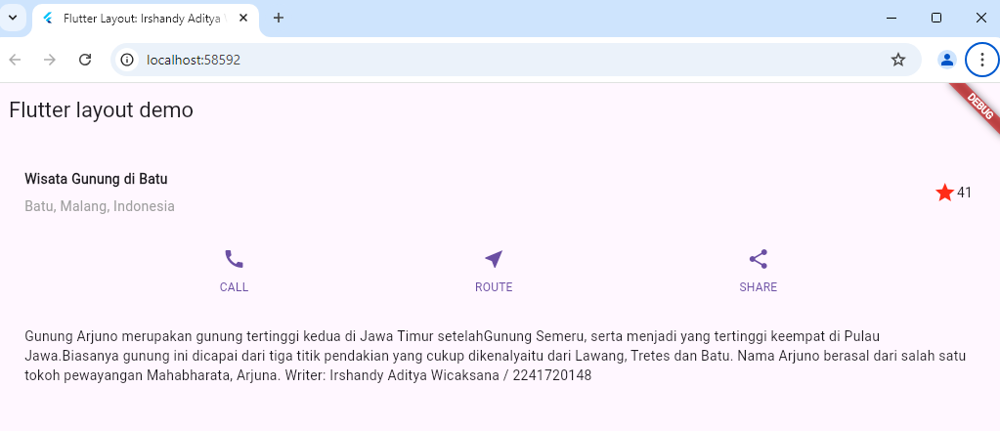
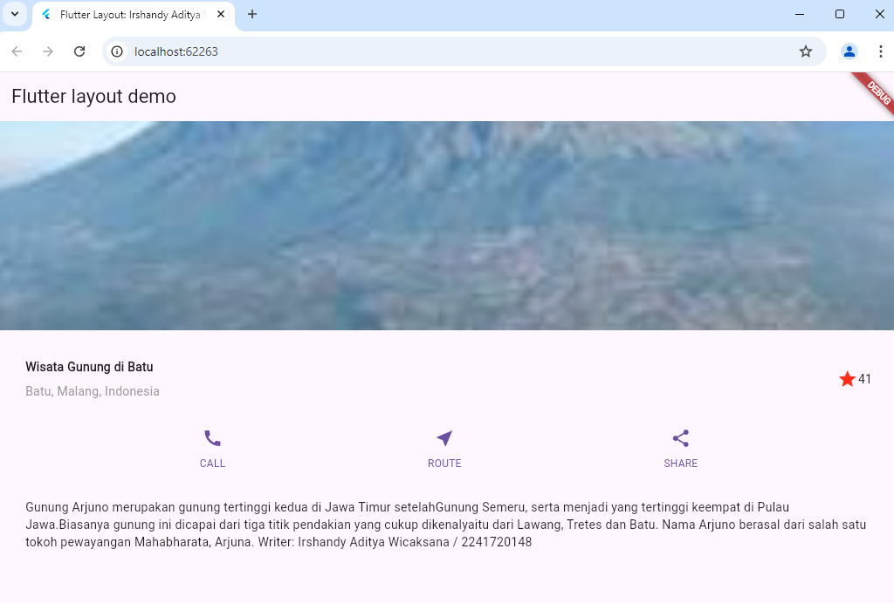

# Dokumentasi
Nama            : Irshandy Aditya Wicaksana
Kelas / Absensi : TI - 3A / 16
NIM             : 2241720148

Praktikum 1:
langkah 1:
Membuat project baru bernama layout_flutter

langkah 2:
Mengubah nama icon, app bar, dan body center

langkah 4:
Mengimplementasikan titleSection yang berisi text yang menyatakan nama tempat wisata, lokasi tempat wisata, dan icon star. 

Praktikum 2:
Implementasi button row yang berisi call, route, dan share beserta iconnya.

Praktikum 3:
Implementasi Text Section. Pada percobaan ini, text section dipakai sebagai deskrpisi dari sebua konten.

Praktikum 4:
Implementasi image section. Dimulai dari penulisan kode agar image terbaca, upload image yang diinginkan, dan tata letak dari images yang akan ditampilkan.
