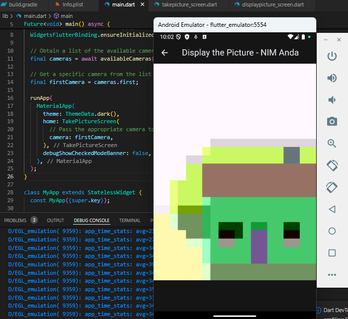
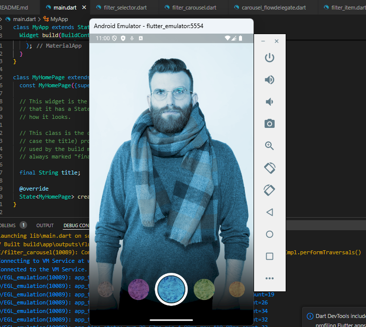
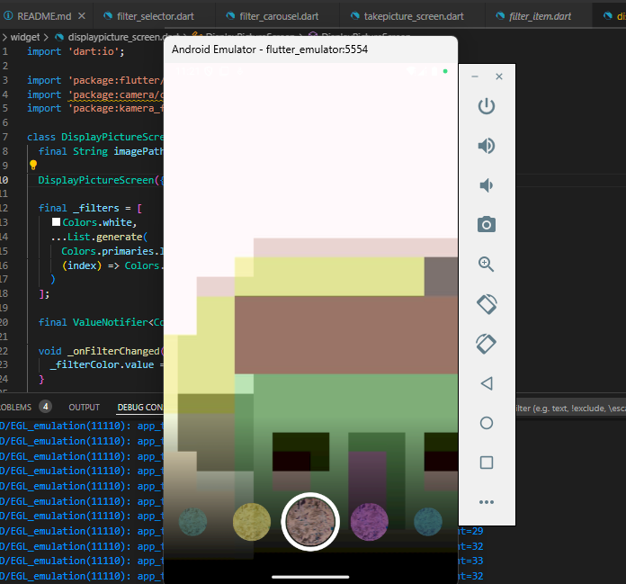

# kamera_flutter

Irshandy Aditya Wicaksana
TI - 3A / 16 - 2241720148

## Jobsheet 9 Kamera
Praktikum 1: (Tugas Praktikum nomor 2 saya jadikan 1 project dengan praktikum 1)
Hasil :

Camera berfungsi dengan baik. Apabila floating buttonnya dipencet, maka akan memotret gambar dan akan menunjukkan gambar yang telah dipotret.

Praktikum 2:
Hasil :

Tujuan dari praktikum 2 adalah untuk memberikan sebuah filter pada foto yang telah ada dan filter tersebut bisa dipilih melalui carrousel yang ada di bagian bawah dari layar

Tugas Praktikum : 
no 2: (Tugas Praktikum nomor 2 saya jadikan 1 project dengan praktikum 1)

no 3:
Void dalam dart merupakan tipe class yang tidak mengembalikan nilai apapun. Pada praktikum 1, terdapat fungsi async pada class void yang menunjukkan bahwa class tersebut akan tidak akan mengembalikan nilai apapun, namun akan menjalankan fungsi yang bersifat asinkron. Dengan ditandai dengan kode 'async', hal ini dimaksudkan bahwa class tersebut akan menjalankan fungsi yang mungkin memakan waktu, seperti mengakses database atau memanggil API.

no 4:
@immutable menunjukkan bahwa semua properti kelas harus bersifat final (tidak dapat diubah setelah inisialisasi). 
sedangkan @override digunakan untuk menunjukkan bahwa sebuah method atau properti sedang mengoverride (mengganti) implementasi dari superclass atau interface.